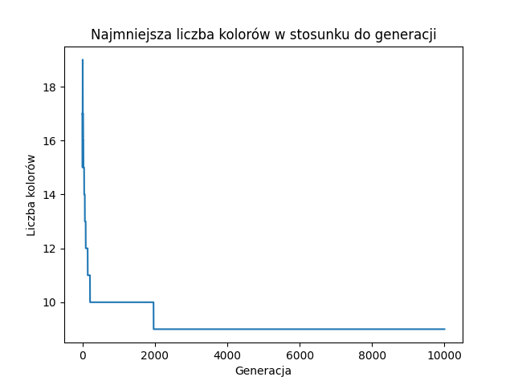

# Genetic algorithm for Graph Coloring

This repository contains a genetic algorithm for the graph coloring problem, along with various methods for crossover and selection in the genetic algorithm approach.

## Graph coloring problem

The graph coloring problem is a classic combinatorial optimization problem where the goal is to assign colors to vertices of a graph in such a way that no two adjacent vertices share the same color. The algorithm provided in this repository aims to find a valid vertex coloring with the minimum number of colors.

### Fitness Function

The fitness function is pivotal in assessing the quality of solutions generated by the graph coloring algorithm. It evaluates the coloring assignment based on conflicts between adjacent vertices, aiming to minimize such conflicts to achieve a valid coloring where no two neighboring vertices share the same color. Additionally, the fitness function considers the number of colors utilized, striving to minimize it while maintaining a valid coloring. Moreover, it emphasizes diversity in the neighborhood of each vertex, encouraging distinct colors among adjacent vertices for balanced coloring.

### Selection Methods

The algorithm employs different selection strategies to choose parents for crossover, promoting diversity and convergence. These selection methods include:

1. **Roulette Wheel Selection** - This method selects individuals for reproduction with a probability proportional to their fitness. Higher fitness individuals have a higher chance of being selected.
2. **Tournament Selection** - In tournament selection, a small subset of individuals is randomly chosen from the population, and the fittest individual from this subset is selected as a parent.
3. **Rank Selection** - Rank-based selection assigns a probability of selection to each individual based on their rank or fitness. Higher-ranked individuals have a higher probability of being selected as parents.

### Crossover Methods

The algorithm implements various crossover methods to explore different solutions efficiently. These crossover methods are:

1. **Single Point Crossover** - This method selects a random point in the parent chromosomes and swaps the tails of the two parents to create offspring.
2. **Two Point Crossover** - Similar to single-point crossover, but it selects two random points in the parent chromosomes and swaps the genetic material between these points to produce offspring.

## Result Presentation

The algorithm's outcomes are presented through a table displaying the obtained minimum number of colors:

    +--------------------+--------+-----------+----------------------+
    |     Graph name     | Colors | Conflicts |       Time(s)        |
    +--------------------+--------+-----------+----------------------+
    | 1-Insertions_4.col |   14   |     0     | 578.9372215270996094 |
    |    myciel3.col     |   4    |     0     | 105.7885866165161133 |
    |    myciel6.col     |   23   |     0     | 456.25992751121521   |
    |    queen5_5.col    |   9    |     0     | 195.921435832977295  |
    |    queen6_6.col    |   12   |     0     | 308.07419753074646   |
    +--------------------+--------+-----------+----------------------+

Additionally, a graph depicting the relationship between the generation number and the number of colors utilized in the assignments is generated, providing insight into the algorithm's convergence behavior.

